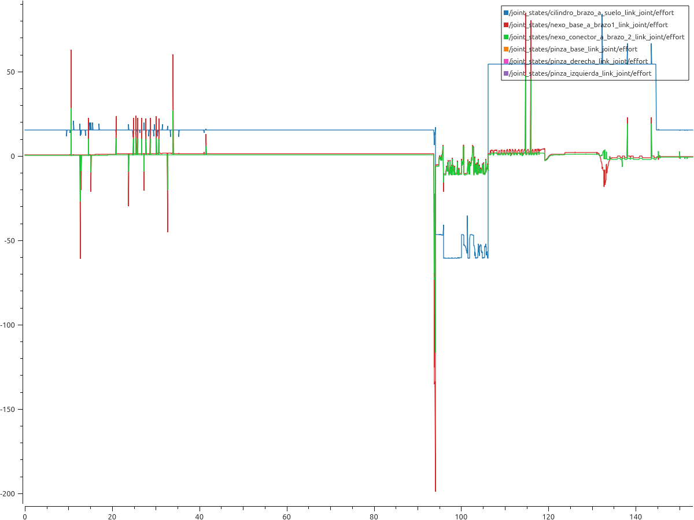
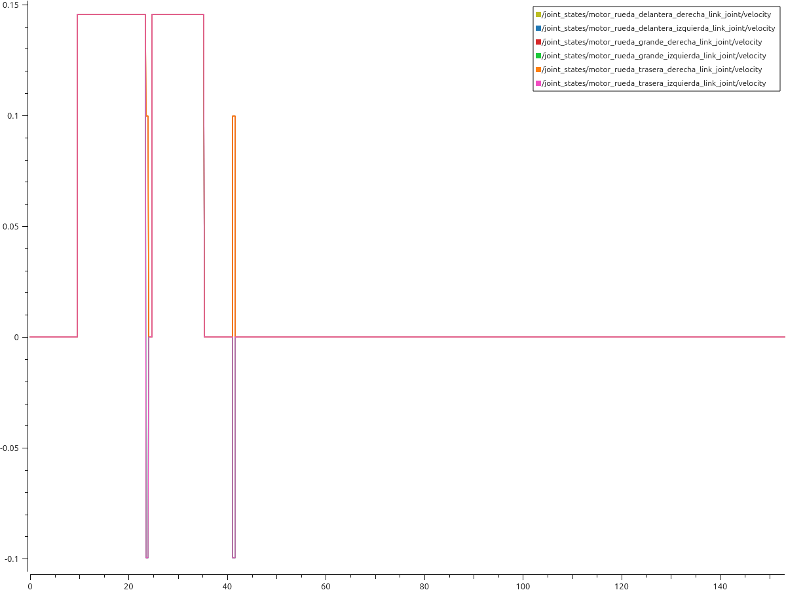
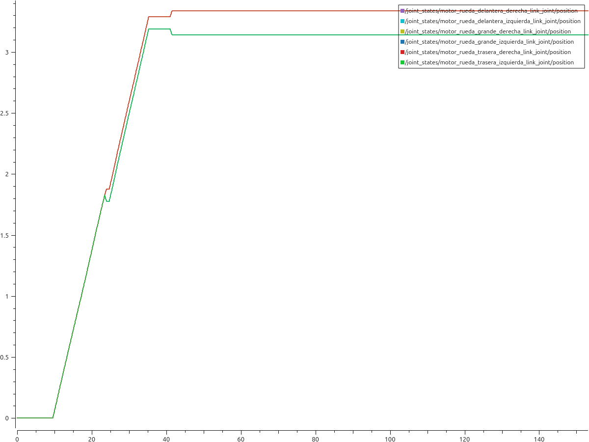

# Modelado y Simulacion P3

## Plot G parcial

Esta grafica corresponde a las G de cada fuerza que actua en cada joint, el principio de la grafica corresponde a la parte que tenemos que encontrar a el robot por lo que el brazo no se mueve por lo que cada g se mantendra mas o menos constante teniendo en cuenta las irregulares del entorno, donde podemos ver mejor las fluctuaciones de las fuerzas es en el joint prismatico que como podemos ver cuando baja hacia el cubo las fuerzas son mas pequeñas y cuando ya coge el cubo la fuerza se vuelve mucho mas fuerte debido a que al tener el cubo la fuerza que hay que ejercer para subirlo es mas fuerte mientras que en el momento que lo deja volvera a la fuerza constante, en el caso de las demas podemos ver que se van volviendo mas fuertes cuando necesitan moverse.

## Plot aceleracion 

Este plot califica las aceleraciones de las ruedas cuando se va moviendo, coo podemos ver no es muy complicado, las aceleraciones solo estarab al principo de la grafica debido a que una vez que encontramos el cubo no se va a mover, cuando vamos hacia el cubo las aceleraciones se mantienen y hay un paraon y luego se gira que es lo correspondiente a despues del paron.

## Plot posicion 

en este plot lo que se evalua es la posicion de las ruedas y no tiene mucho misterio va avanzando hasta que llega a la posicion que queremos y se quedara ahi hasta que se vuelva a mover.

